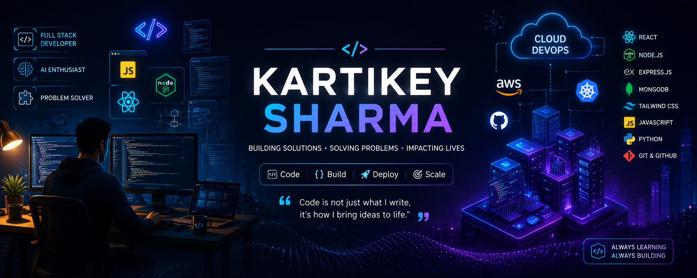

  

<h1 align="center">Hi 👋, I'm Kartikey Sharma</h1>
<h3 align="center">Passionate Full Stack Developer and B.Tech CSE student focused on building impactful web and AI-powered applications. Skilled in MERN Stack, FastAPI, REST APIs, and modern development practices, with a strong interest in problem-solving and software engineering.</h3>

### Full Stack Developer | AI Enthusiast | B.Tech CSE Student

🚀 Building scalable web applications

💻 MERN Stack Developer

🤖 Exploring AI and LLM Applications

📚 Currently learning DevOps & Cloud

🌱 Always building and learning

| Category | Skills |
|----------|---------|
| Languages |      |
| Frontend |     |
| Styling |   |
| Backend |    |
| Databases |   |
| AI & LLM |     |
| Tools |     |
| Deployment |    |
| Core CS |     |
